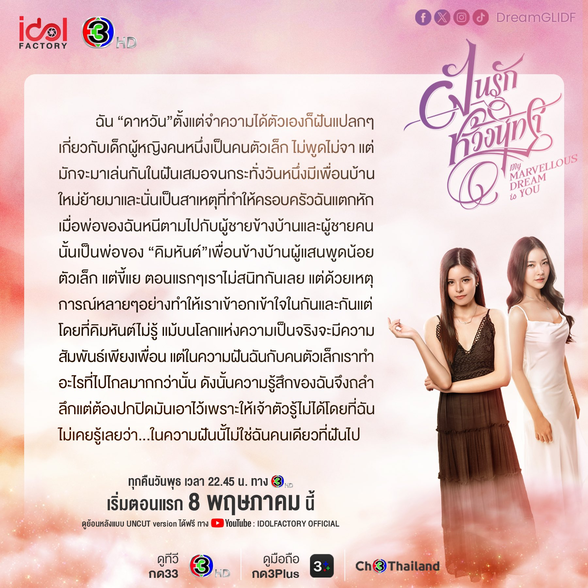
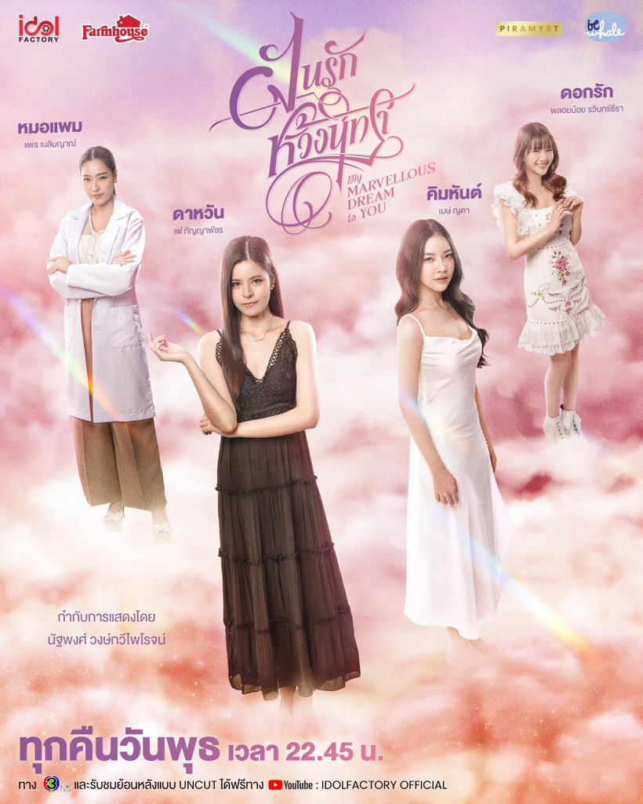
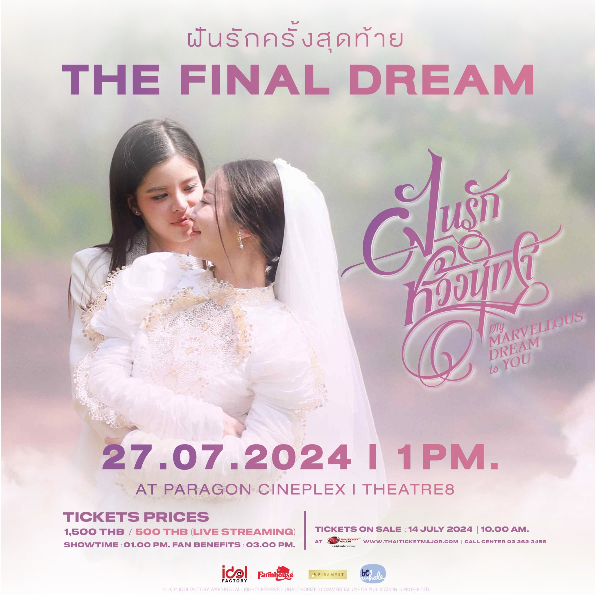

<!-- Main -->

	<section id="one">
		

			<header class="major">
				<h2>My Marvellous Dream is You (ฝันรักห้วงนิทรา)</h2>
			</header>
			
I'm "Dawhan". Since I can remember, I have always had strange dreams about a young girl who was quiet but often played with me in my dreams. One day, a new neighbor moved in, and that led to my family falling apart. My father ran away with the man next door, who turned out to be the father of "Kimhun" the quiet & small girl from next door. Initially, we were not close at all, but various circumstances brought us closer and made us understand each other. However, Kimhun was unaware that while in the real world we were just friends, in my dreams, the small girl and I did things that went far beyond that. So, I kept my feelings concealed because I couldn't let her know. I never realized that in those dreams, I was not the only one dreaming.

			<strong>Genres:</strong> Romance, Fantasy 
			<header class="major">
				<h3>Main roles: </h3>
			</header>
			
Please follow and support all the Dream Girls! They are talented actresses, and their TikTok videos are very fun.

			

				<table>
					<thead>
						<tr>
							<th scope="col">Name</th>
							<th scope="col">Full Name</th>
							<th scope="col">Instagram</th>
							<th scope="col">Twitter</th>
							<th scope="col">TikTok</th>
							<th scope="col">Hashtag</th>
						</tr>
					</thead>
					<tbody>
						<tr>
							<td>Fay</td>
							<td>Kunyaphat Na Nakorn</td>
							<td><a href="https://www.instagram.com/fay_riezz/">@fay_riezz</a></td>
							<td><a href="https://x.com/Fay_riezz">@fay_riezz</a></td>
							<td><a href="https://www.tiktok.com/@fay_riezz">@fay_riezz</a></td>
							<td>#fay_riezz</td>
						</tr>
						<tr>
							<td>May</td>
							<td>Yada Watcharamusik</td>							
							<td><a href="https://www.instagram.com/maywyda/">@maywyda</a></td>
							<td><a href="https://x.com/maywyda">@maywyda</a></td>
							<td><a href="https://www.tiktok.com/@maywyda">@maywyda</a></td>
							<td>#maywyda</td>
						</tr>
						<tr>
							<td>Pear</td>
							<td>Neilinyah Taweearayapat</td>							
							<td><a href="https://www.instagram.com/pearneilinyah/">@pearneilinyah</a></td>
							<td><a href="https://x.com/pearneilinyah">@pearneilinyah</a></td>
							<td><a href="https://www.tiktok.com/@pearneilinyah">@pearneilinyah</a></td>
							<td>#pearneilinyah</td>
						</tr>
						<tr>
							<td>Ploynoii</td>
							<td>Kannalin Yinghiranphat</td>							
							<td><a href="https://www.instagram.com/ploynoii/">@ploynoii</a></td>
							<td><a href="https://x.com/ploynoll">@ploynoll</a></td>
							<td><a href="https://www.tiktok.com/@ploynoiikannalin">@ploynoiikannalin</a></td>
							<td>#PloynoiiKannalin</td>
						</tr>
						<tr>
							<td>Songjet (27)</td>
							<td>Sarochinee Pethampai</td>							
							<td><a href="https://www.instagram.com/ssongjet/">@ssongjet</a></td>
							<td><a href="https://x.com/ssongjet">@ssongjet</a></td>
							<td><a href="https://www.tiktok.com/@ssongjet">@ssongjet</a></td>
							<td>#ssongjet</td>
						</tr>
						<tr>
							<td>Looknam</td>
							<td>Orntara Poolsak</td>							
							<td><a href="https://www.instagram.com/namorntaraaa/">@namorntaraaa</a></td>
							<td><a href="https://x.com/namorntaraaa">@namorntaraaa</a></td>
							<td><a href="https://www.tiktok.com/@namorntaraaa">@namorntaraaa</a></td>
							<td>#namorntaraaa</td>
						</tr>
						<tr>
							<td>Frung</td>
							<td>Prompatcha Snitwongse Na Ayudthaya</td>							
							<td><a href="https://www.instagram.com/frruunngg/">@frruunngg</a></td>
							<td><a href="https://x.com/frruunngg">@frruunngg</a></td>
							<td><a href="https://www.tiktok.com/@frruunnggg">@frruunngg</a></td>
							<td>#frruunngg</td>
						</tr>
					</tbody>
				</table>
			

		

	</section>
	<section class="spotlights">
		<section>
			

				
			

			

				

					<header class="major">
						<h3>Teasers</h3>
					</header>
					
This is the link to the <a href="https://youtube.com/playlist?list=PL4D0KlUVq4IwGzHhJJOjghXfF23PnG96i&si=PHltvEgXwS4hKR2w">playlist of series teasers</a> by Idol Factory.

				

			

		</section>
		<section>
			

				
			

			

				

					<header class="major">
						<h3>UNCUT Episodes</h3>
					</header>
					
Please watch the series. It's a slow burn and might make you feel frustrated at times, but FayMay's chemistry is incredible, and the acting from the whole cast is brilliant. Watching it once isn't enough, so please watch the whole series a few times.

					

						<table>
							<thead>
								<tr>
									<th scope="col">Episode</th>
									<th scope="col">Teaser [Spoiler]</th>
									<th scope="col">Premiered</th>
								</tr>
							</thead>
							<tbody>
								<tr>
									<td><a href="https://youtube.com/playlist?list=PL4D0KlUVq4IyWIZVo-oo-rvYWPxX3WVn6&si=-oVwipMsq5-B4ihC">EP.1</a></td>
									<td>After a falling out with Dawhan, Kimhan made the decision to join Jessie, Dawhan's rival. Mali, feeling unsettled by the situation, took it upon herself to conduct an investigation, ultimately uncovering the true reason behind Kimhan's decisioned.</td>
									<td>May 8, 2024</td>
								</tr>
								<tr>
									<td><a href="https://youtube.com/playlist?list=PL4D0KlUVq4IxVB-flF0y2Ci-ZlTYPhBkE&si=wsR153JrN-M1T9nT">EP.2</a></td>
									<td>Dawhan finally understood the true reason why Kimhun agreed to work for Jessie, enabling both of them to come to an understanding. Dawhan refused to let Jessie use Kimhun as a tool and challenged Jessie to release evidence used to blackmail her.</td>
									<td>May 15, 2024</td>
								</tr>
								<tr>
									<td><a href="https://youtube.com/playlist?list=PL4D0KlUVq4Izf5NcVj9LXTg4I-p0vGENI&si=7GvuY_pSwxxuLbuY">EP.3</a></td>
									<td>Dawhan encountered a social media frenzy after she brought Kimhan back to the condo until dizziness. Toon decided to use the trending couple "Pat-Dawhan" to deflect attention by releasing a leaked video clip.</td>
									<td>May 23, 2024</td>
								</tr>
								<tr>
									<td><a href="https://youtube.com/playlist?list=PL4D0KlUVq4IwDLuIueFYYfRNGdNtCB76v&si=OUU0Ly1jKe58UQTn">EP.4</a></td>
									<td>Kimhun had a chance encounter with Mawin, the proprietor of the gallery. This unexpected meeting led Kimhun to a decision to work with Mawin's gallery, a choice that brought her sincere joy. Despite Dawan's efforts to impede her, but Kimhun joined the gallery, igniting a heated dispute between them.</td>
									<td>May 30, 2024</td>
								</tr>
								<tr>
									<td><a href="https://youtube.com/playlist?list=PL4D0KlUVq4Ix6yAX3JI3nFmeBLJHuc3Nq&si=rLzAOAI-rYV_SVdQ">EP.5</a></td>
									<td>Dawan tried every possible way to interrupt Mawin, leading to a conflict with Kimhan and causing Dawan to choose to return home. While Dawan was asleep, she dreamed of Kimhan drawing a picture of Kim Han together with herselves, but the image transformed into a picture of Mawin instead.</td>
									<td>Jun 5, 2024</td>
								</tr>
								<tr>
									<td><a href="https://youtube.com/playlist?list=PL4D0KlUVq4IwP5Na9SFb8cWY1Kzd2hpy3&si=DMuvavAmgDcREepO">EP.6</a></td>
									<td>Pat confesses his love to Dawan. Upon found out this, Kimhan fell ill and was hospitalized. Kimhan opted to leave the room she shared with Dawan. However, she encountered Dawan embracing Pat, leading the two to argue. In the heat of the moment, Kimhan unintentionally revealed his affection for Mawin.</td>
									<td>Jun 12, 2024</td>
								</tr>
								<tr>
									<td><a href="https://youtube.com/playlist?list=PL4D0KlUVq4IxGS_98gM6ZzsGmwPlvxBBp&si=n-6sLQ5o7reuyUFu">EP.7</a></td>
									<td>Kimhan agrees to be Mawin's girlfriend to secure Dawan's future. Dawan missed opportunities to represent Thailand as an actress and underwent treatment for depression.</td>
									<td>Jun 19, 2024</td>
								</tr>
								<tr>
									<td><a href="https://youtube.com/playlist?list=PL4D0KlUVq4Ix_z_a9JyWjQAxBUMCgPl0m&si=bsZdD5lITNigeAAn">EP.8</a></td>
									<td>Dawan and Kimhan both reconcile again with a sweet kiss. Tim and Pongphon, the people who left both the Dawan and Kimhan families in misery, come back to meet the four of them again.</td>
									<td>Jun 26, 2024</td>
								</tr>
								<tr>
									<td><a href="https://youtube.com/playlist?list=PL4D0KlUVq4IyVK6YahPZ_ekhSNW6XD6Hd&si=obW0G1Cct1dvWoOC">EP.9</a></td>
									<td>Ae, Kimhan's mother, fell suddenly ill and expressed her wish to see Kimhan and Marwin get married. Despite Kimhan's desire to fulfill her mother's wish, but in her heart, she only loved Dawan.</td>
									<td>Jul 3, 2024</td>
								</tr>
								<tr>
									<td><a href="https://youtube.com/playlist?list=PL4D0KlUVq4IxMwZyWkOTWDG1GIyL5fy9O&si=Gzv2APYj_3SAOByp">EP.10</a></td>
									<td>Dawan is reluctant to attend Kimhan and Marwin's wedding at first. However, upon reading Kimhan's heartfelt letter confessing her feelings, Dawan immediately drops everything and rushes to the wedding to see Kimhan.</td>
									<td>Jul 10, 2024</td>
								</tr>
								<tr>
									<td><a href="https://youtube.com/playlist?list=PL4D0KlUVq4IxCOL0o-tahFEnxkGbgsf7i&si=Fc0phyIY-gLAHjF5">EP.11</a></td>
									<td>Kimhan decides to run away from the wedding with Dawan. This decision brought they back together again. As for Mother Ae, after her worries were over she passed away peacefully.</td>
									<td>Jul 17, 2024</td>
								</tr>
								<tr>
									<td><a href="https://youtube.com/playlist?list=PL4D0KlUVq4Iwq9Nvhr7Nat9V9w-rCAxwm&si=fssHBwA0DfheA9aO">EP.12</a></td>
									<td>I am happiest when I'm in a dream, because in it... you are there</td>
									<td>Aug 7, 2024</td>
								</tr>
							</tbody>
						</table>
					

				

			

		</section>
		<section>
			

				
			

			

				

					<header class="major">
						<h3>OSTs</h3>
					</header>
					
The OSTs in this series are chef's kiss. Please show them some love!

					

						<table>
							<thead>
								<tr>
									<th scope="col">Language</th>
									<th scope="col">Title</th>
									<th scope="col">Vocal</th>
									<th scope="col">Producer</th>
								</tr>
							</thead>
							<tbody>
								<tr>
									<td>Thai</td>
									<td><a href="https://www.youtube.com/watch?v=qM9R243mhAQ">8 ชั่วโมง (SEE YOU IN MY DREAM)</a></td>
									<td>Fay Kunyaphat , May Yada</td>
									<td>Boy Sompob, Kawin Wannasiri</td>
								</tr>
								<tr>
									<td>Thai</td>
									<td><a href="https://youtu.be/ppPAfY94S4w?si=I3zccC7u2iptBE81">เธอคือฝันดี (Reverie)</a></td>
									<td>Mint Mintita</td>
									<td>Boy Sompob, Kawin Wannasiri</td>
								</tr>
								<tr>
									<td>English</td>
									<td><a href="https://youtu.be/CKuTbLCfeWI?si=anMbJyV3HAIrz2Lq">Awake</a></td>
									<td>Boy Sompob</td>
									<td>Boy Sompob, Kawin Wannasiri</td>
								</tr>
							</tbody>
						</table>
					

				

			

		</section>
	</section>
	<!-- Three -->
	<section id="three">
		

			<header class="major">
				<h2>Fun Facts: </h2>
			</header>
			<ol>
				<li>
					<a href="https://x.com/4ever_Marvelous/status/1823929864354980029">
						You can find the English translation of the casting call here.
					</a>
				</li>
				<li>
					May didn't even plan to audition that day; she was just accompanying her friend. Her friend convinced her to audition once they were already at the event. We should all thank May's friend!
				</li>
				<li>
					Fay and May met at the audition event for the first time, and they were both wearing similar black jackets.
				</li>
				<li>
					The friend who came with Fay is also May's friend, so they had a mutual friend but didn't get a chance to talk before the audition started.
				</li>
				<li>
					Their chemistry was insanely good that day. Many people in the audience watching the audition livestream were cheering for them to be the final two leads.
				</li>
				<li>
					That evening, after the audition ended, they had their first TikTok LIVE together with their mutual friend.
				</li>
				<li>
					After that TikTok LIVE, they had an Instagram LIVE with just the two of them.
				</li>
				<li>
					<a href="https://youtube.com/playlist?list=PLq_CJ-WP1k0fcFN3McQiWfVfFGjs79Umn&si=YJPOgl2yF4xYU1Od">
						You can watch some of the subtitled videos about casting day in this playlist.
					</a>
				</li>
			</ol>
		

	</section> 
	<!-- Image carousel -->
    

        <button type="button" class="carousel-arrow carousel-prev">&lt;</button>
        

			

			

			

			

			

			

			

			

			

			

			

			

			

			

			

			

			

			

		

        <button type="button" class="carousel-arrow carousel-next">&gt;</button>
    

<!-- Spoiler tag script -->
